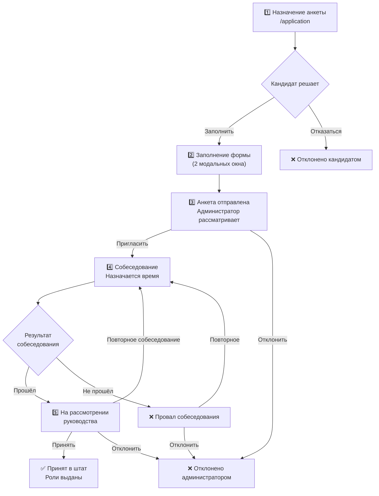

# 📋 Документация для персонала

> Полное руководство по работе с ботом для всех сотрудников проекта.

---

## 📑 Содержание

1. [Иерархия ролей и права доступа](#-иерархия-ролей-и-права-доступа)
2. [Модерация](#-модерация)
3. [Система набора хелперов](#-система-набора-хелперов)
4. [Автоматические системы](#-автоматические-системы)
5. [Утилиты и общие команды](#-утилиты-и-общие-команды)
6. [Регламенты и правила для персонала](#-регламенты-и-правила-для-персонала)

---

## 👥 Иерархия ролей и права доступа

Бот использует систему ролей для определения уровня доступа к командам. Каждая роль наследует права нижестоящих групп.

### Роли от высшей к низшей

| Уровень | Группа | Описание |
|---------|--------|----------|
| 🔴 | **Owner** | Владельцы и главные администраторы |
| 🟠 | **Head Admin** | Высшая администрация |
| 🟡 | **Admin** | Администраторы |
| 🟢 | **Senior Mod** | Старшие модераторы |
| 🔵 | **Moderator** | Модераторы |
| ⚪ | **Helper** | Хелперы / Младший персонал |

### Матрица прав

| Действие | Owner | Head Admin | Admin | Senior Mod | Moderator | Helper |
|----------|:-----:|:----------:|:-----:|:----------:|:---------:|:------:|
| `/ban` и `/unban` | ✅ | ✅ | ✅ | ✅ | ❌ | ❌ |
| `/kick` | ✅ | ✅ | ✅ | ✅ | ✅ | ❌ |
| `/warn` и `/unwarn` | ✅ | ✅ | ✅ | ✅ | ✅ | ❌ |
| `/culture` | ✅ | ✅ | ✅ | ✅ | ✅ | ✅ |
| `/application` (назначить анкету) | ✅ | ✅ | ✅ | ✅ | ✅ | ❌ |
| Принять на работу (Hire) | ✅ | ✅ | ✅ | ✅ | ❌ | ❌ |
| Использование @everyone/@here | ✅ | ✅ | ✅ | ✅ | ✅ | ❌ |

---

## 🛡️ Модерация

### `/ban` (`/бан`) — Бан пользователя

Блокирует доступ пользователя к серверу.

**Параметры:**
| Параметр | Обязательно | Описание |
|----------|:-----------:|----------|
| `user` / `пользователь` | ✅ | Кого забанить |
| `reason` / `причина` | ✅ | Причина бана (до 500 символов) |
| `duration` / `срок` | ❌ | Срок бана |

**Доступные сроки бана:**
- `1h` — 1 час
- `1d` — 1 день
- `7d` — 7 дней
- `30d` — 30 дней
- `perm` — Навсегда (по умолчанию, если не указано)

**Пример использования:**
```
/ban user:@НарушительИмя reason:Читерство duration:30d
/бан пользователь:@НарушительИмя причина:Читерство срок:Навсегда
```

> [!IMPORTANT]
> Всегда указывайте **конкретную** причину бана. «Нарушение правил» — не принимается. Опишите, что именно нарушил пользователь.

---

### `/kick` (`/кик`) — Кик пользователя

Исключает пользователя с сервера. Он может зайти снова по пригласительной ссылке.

**Параметры:**
| Параметр | Обязательно | Описание |
|----------|:-----------:|----------|
| `user` / `пользователь` | ✅ | Кого кикнуть |
| `reason` / `причина` | ✅ | Причина кика (до 500 символов) |

**Пример:**
```
/kick user:@Пользователь reason:Спам в голосовых каналах
```

---

### `/warn` (`/варн`) — Выдать предупреждение

Выдаёт предупреждение пользователю. Предупреждения накапливаются — при достижении **3 активных варнов** пользователь **автоматически банится**.

**Параметры:**
| Параметр | Обязательно | Описание |
|----------|:-----------:|----------|
| `user` / `пользователь` | ✅ | Кому выдать варн |
| `reason` / `причина` | ✅ | Причина (до 500 символов) |

**Пример:**
```
/warn user:@Пользователь reason:Оскорбление участника
```

> [!WARNING]
> Нельзя выдать предупреждение боту. Система предупреждений работает **только с пользователями**.

> [!CAUTION]
> **3 активных варна = автобан**. Перед выдачей третьего предупреждения убедитесь, что ситуация этого требует. Проверьте историю через `/warns`.

---

### `/warns` (`/варны`) — Просмотр предупреждений

Показывает список активных предупреждений пользователя (до 10 последних).

**Параметры:**
| Параметр | Обязательно | Описание |
|----------|:-----------:|----------|
| `user` / `пользователь` | ✅ | Чьи варны проверить |

**Что показывает:**
- Список кейсов с номерами
- Причину каждого варна
- Модератора, выдавшего варн
- Общую статистику по пользователю

---

### `/unban` (`/разбан`) — Разблокировка пользователя

Снимает бан с пользователя.

**Параметры:**
| Параметр | Обязательно | Описание |
|----------|:-----------:|----------|
| `user_id` / `id_пользователя` | ✅ | ID пользователя (17-20 цифр) |
| `reason` / `причина` | ❌ | Причина разбана (до 500 символов) |

**Пример:**
```
/unban user_id:123456789012345678 reason:Срок бана истёк
```

> [!NOTE]
> Здесь используется **ID пользователя**, а не упоминание (@). Скопируйте ID через Developer Mode в Discord (ПКМ по пользователю → «Копировать ID»).

---

### `/unwarn` (`/снятьварн`) — Снять предупреждение

Удаляет конкретное предупреждение по номеру кейса.

**Параметры:**
| Параметр | Обязательно | Описание |
|----------|:-----------:|----------|
| `case` / `кейс` | ✅ | Номер кейса предупреждения (мин. 1) |
| `reason` / `причина` | ❌ | Причина снятия (до 500 символов) |

**Пример:**
```
/unwarn case:42 reason:Ошибка при выдаче варна
```

> [!TIP]
> Перед снятием варна используйте `/warns` чтобы узнать номер кейса.

---

### `/culture` (`/культура`) — Напоминание о культуре общения

Отправляет красивое напоминание пользователю о правилах поведения. **Не является наказанием** — это мягкая мера для перевоспитания.

**Параметры:**
| Параметр | Обязательно | Описание |
|----------|:-----------:|----------|
| `user` / `пользователь` | ✅ | Кому напомнить о культуре |
| `message` / `сообщение` | ❌ | Дополнительный комментарий (до 300 символов) |

**Что отправляет бот:**
- Красивый embed с правилами:
  - 🚫 Брань и оскорбления недопустимы
  - 🤝 Уважайте собеседников и администрацию
  - 💬 Излагайте проблему спокойно и конструктивно
  - ⏳ Дайте время на рассмотрение обращения
- Если указан комментарий — добавляется поле «Комментарий модератора»

**Пример:**
```
/culture user:@Пользователь message:Пожалуйста, не ругайтесь в общем чате
```

> [!TIP]
> Команда `/culture` доступна **всем сотрудникам**, включая хелперов. Используйте её как первую меру воздействия перед предупреждением.

---

## 📝 Система набора хелперов

Бот предоставляет полноценный pipeline для набора персонала с пошаговым процессом.

### Этапы найма



### Шаг 1: Назначение анкеты

**Команда:** `/application user:@Кандидат` (или `/анкета пользователь:@Кандидат`)

Администратор или модератор назначает анкету хелпера указанному пользователю. Бот отправит в текущий канал сообщение с двумя кнопками:

- **📝 Заполнить анкету** — кандидат начинает заполнение
- **❌ Отказаться** — кандидат отклоняет приглашение

> [!IMPORTANT]
> Нельзя назначить анкету пользователю, у которого уже есть активная анкета. Сначала дождитесь завершения предыдущей.

### Шаг 2: Заполнение анкеты

Кандидат нажимает **«Заполнить анкету»** и ему открывается два модальных окна:

**Модальное окно 1/2:**

| Поле | Описание | Обязательно |
|------|----------|:-----------:|
| SteamID 64 | Формат: 76561198xxxxxxxxx | ✅ |
| Игровой никнейм | Ник в Unturned | ✅ |
| Ваше имя | Реальное имя | ✅ |
| Возраст | Число (1-3 символа) | ✅ |
| Часы в Unturned | Количество игровых часов | ✅ |

**Модальное окно 2/2:**

| Поле | Описание | Обязательно |
|------|----------|:-----------:|
| Discord | user#0000 или @username | ✅ |
| Telegram | @username | ✅ |
| Номер сервера | На какой сервер хочет (1, 2, 3...) | ✅ |
| Сколько времени | Свободное время для сервера | ✅ |
| Навык проверки на ПО | Оценка 1-10 | ✅ |

После заполнения анкета появляется в канале для администратора.

### Шаг 3: Рассмотрение анкеты

Администратор (тот, кто назначил анкету) видит заполненную форму и кнопки:

- **📞 Пригласить на собеседование** — назначить время интервью
- **❌ Отклонить** — отказать кандидату

### Шаг 4: Собеседование

При нажатии «Пригласить на собеседование» откроется окно для ввода времени (по МСК). Кандидат получит DM-уведомление с временем и кнопками:

- **✅ Подтвердить** — кандидат подтверждает участие
- **🔄 Перенести** — запрос на перенос (с указанием удобного времени)

После собеседования администратор может:

- **✅ Отправить на рассмотрение** — если собеседование пройдено
- **❌ Провал** — если не пройдено
- **❌ Отклонить** — полный отказ

При провале доступны:
- **🔄 Повторное собеседование** — дать ещё шанс
- **❌ Отклонить** — окончательный отказ

### Шаг 5: Рассмотрение руководством

Когда администратор отправляет заявку на рассмотрение, пингуются указанные роли руководства. Они видят:

- **✅ Принять в штат** — подтвердить найм
- **🔄 Повторное собеседование** — отправить на пересобеседование
- **❌ Отклонить** — отказать

### Финал: Принятие в штат

При найме автоматически происходит:
1. ✅ Кандидату назначаются **роли хелпера**
2. ✅ Кандидат получает **DM-уведомление** о принятии
3. ✅ В штабной канал отправляется **уведомление** о новом сотруднике
4. ✅ Все действия **логируются** в лог-канал

При отклонении:
1. Кандидат получает DM о решении
2. Анкета закрывается
3. Действие логируется

### Таблица прав по этапам

| Действие | Кто может |
|----------|-----------|
| Назначить анкету | Owner, Head Admin, Admin, Senior Mod, Moderator |
| Пригласить на собеседование | Только **назначивший** администратор |
| Отметить провал/успех | Только **назначивший** администратор |
| Отклонить заявку | Только **назначивший** администратор |
| Отправить на рассмотрение | Только **назначивший** администратор |
| Принять в штат (Hire) | Owner, Head Admin, Admin, Senior Mod |

---

## 🤖 Автоматические системы

Бот имеет несколько автоматических систем, которые работают **без участия персонала**.

### Фильтр нецензурной лексики

Бот автоматически фильтрует сообщения по списку запрещённых слов.

**Как работает:**
1. Пользователь отправляет сообщение
2. Бот нормализует текст (убирает замену символов: `0→o`, `1→i`, `3→e`, `4→a`, `5→s` и т.д.)
3. Если найдено запрещённое слово — сообщение **удаляется**
4. Применяется система эскалации наказаний

**Система эскалации:**

| Нарушение | Действие | Подробности |
|:---------:|----------|-------------|
| 1-е | ⚠️ Предупреждение | Embed с напоминанием о правилах (удаляется через 30 сек) |
| 2-е | ⏱️ Таймаут | 5 минут |
| 3-е | ⏱️ Таймаут | 1 час |
| 4-е | ⏱️ Таймаут | 24 часа |
| 5-е | 🔨 Бан | Автоматический бан |

> [!NOTE]
> Нарушения **сбрасываются** через 7 дней бездействия. Если пользователь не нарушал правила 7 дней — счётчик обнуляется.

**Исключения:**
- Каналы, указанные в конфигурации `exempt_channels`
- Роли, указанные в конфигурации `exempt_roles`
- Слова из белого списка (`whitelist`)

---

### Контроль @everyone/@here

Бот удаляет сообщения с @everyone/@here от пользователей, **не имеющих на это прав**.

Разрешено использовать: Owner, Head Admin, Admin, Senior Mod, Moderator.

Если обычный пользователь попытается — сообщение удалится, и бот отправит временное уведомление.

---

### Канал скриншотов

Настроенный канал, в котором разрешены **только изображения**.

**Как работает:**
- Сообщения без изображений (вложений или embed) **автоматически удаляются**
- К изображениям автоматически добавляются реакции: 👍 👎 ❤️
- Пользователь получает временное уведомление при удалении

---

## 🔧 Утилиты и общие команды

### `/server` (`/сервер`) — Статус серверов

Показывает онлайн-статус всех игровых серверов.

**Что отображает для каждого сервера:**
- Название и иконку
- Статус (🟢 онлайн / 🔴 офлайн)
- Количество игроков (`players/maxPlayers`)
- IP-адрес и порт
- Код подключения

**Серверы проекта:**

| Сервер | Порт |
|--------|------|
| 🧡 PEI | 25015 |
| 🧡 RUSSIA | 25025 |
| 🧡 WASHINGTON | 25035 |
| 🧡 PVP 25 KITS | 25045 |

> [!TIP]
> Статус серверов кешируется для мгновенного ответа. В подвале embed показано время последнего обновления.

---

### `/status` (`/статус`) — Статус бота

Показывает техническую информацию о состоянии бота (ephemeral — видно только вам):
- Аптайм
- Использование памяти
- Задержка API
- Статус базы данных
- Системная информация

---

### `/lang` (`/язык`) — Смена языка

Переключает язык интерфейса бота между **русским** и **английским**.

**Варианты:**
- Без параметров — показывает текущий язык
- `language:ru` — Русский
- `language:en` — English

---

### `/tictactoe` (`/крестики-нолики`) — Крестики-нолики

Мини-игра для развлечения. Можно играть с другим пользователем или с ботом.

**Параметры:**
| Параметр | Обязательно | Описание |
|----------|:-----------:|----------|
| `opponent` / `соперник` | ✅ | Кого вызвать на игру |

---

## 📜 Регламенты и правила для персонала

### Порядок применения наказаний

Рекомендуемая последовательность мер воздействия (от мягкого к жёсткому):

```
/culture → /warn → /kick → /ban (временный) → /ban (перманентный)
```

1. **`/culture`** — Первая мера. Вежливое напоминание о правилах. Используйте при незначительных нарушениях тона.
2. **`/warn`** — При повторных нарушениях или серьёзных проступках. Помните: 3 варна = автобан.
3. **`/kick`** — Если пользователь игнорирует предупреждения. Применяется как промежуточная мера.
4. **`/ban` (временный)** — За серьёзные нарушения: 1d, 7d, 30d в зависимости от тяжести.
5. **`/ban` (перманентный)** — Крайняя мера: читы, DDoS-угрозы, систематическое нарушение правил.

### Правила набора хелперов

1. **Выберите подходящий канал** — назначайте анкету в канале для набора.
2. **Проверьте историю кандидата** — используйте `/warns` перед назначением анкеты.
3. **Подготовьте вопросы** — перед собеседованием заранее подготовьте вопросы по игре.
4. **Оцените объективно** — навык проверки на ПО, часы в игре, возраст, адекватность.
5. **Не задерживайте процесс** — если назначили анкету, обработайте её в течение 48 часов.
6. **Консультируйтесь с руководством** — при сомнениях используйте кнопку «Отправить на рассмотрение».

### Что делать нельзя

> [!CAUTION]
> - ❌ Банить/кикать без указания причины
> - ❌ Использовать модерацию в личных целях
> - ❌ Назначать анкеты друзьям/знакомым без объективной оценки
> - ❌ Игнорировать назначенные анкеты
> - ❌ Выдавать варны за субъективные причины
> - ❌ Разглашать содержимое анкет третьим лицам

### Полезные советы

> [!TIP]
> - 💡 Используйте `/warns` перед каждым наказанием — знайте историю нарушителя
> - 💡 `/culture` — ваш лучший друг при незначительных нарушениях
> - 💡 Все команды доступны на **русском и английском** — используйте удобный
> - 💡 Все ответы бота видны всем (кроме `/status`) — будьте аккуратны
> - 💡 При бане — укажите срок, если нарушение не критичное

---

*Документация актуальна на февраль 2026 года.*
